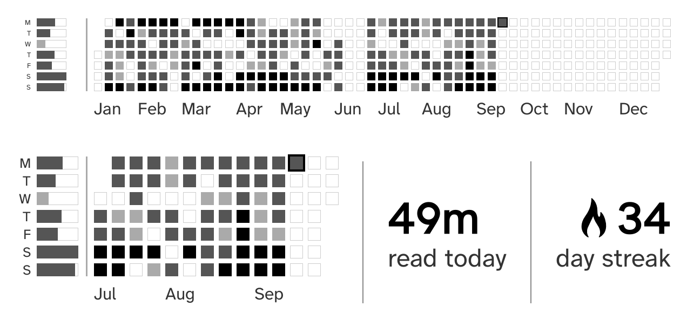

# zenos-heatmap

A KOReader plugin that adds a **Reading heatmap** widget to the
[ZenOS](https://github.com/xZenLabs/zen-os) Home page: a calendar of the
minutes you read each day, drawn in the same flat cells ZenOS uses, with your
typical week beside it. Nothing in ZenOS is changed; delete the folder and
Home is back to stock.

## Install

1. Download `zenheatmap.koplugin.zip` from the
   [latest release](../../releases/latest) and unzip it into
   `koreader/plugins/`, so you have `koreader/plugins/zenheatmap.koplugin/`.
2. Restart KOReader.
3. Turn it on with **Show on Home** under **More tools > Reading heatmap**
   in the KOReader menu, then move it in Home's edit mode or under
   **Zen Settings > Home > Widgets**.

**Show on Home** works even when Home is already full and the Widgets list
says "Not enough Home space": ZenOS then shrinks the other widgets a little
to make room. Turning the widget on from the Widgets list instead needs a
free row.

## Settings

Under **More tools > Reading heatmap** in the KOReader menu. ZenOS can also
put it on a Launcher or Controls button.

| Setting | Choices | Default |
| --- | --- | --- |
| Show on Home | on, off | off |
| Range | Year to date, 3 months, Month | Year to date |
| Typical week | on, off | on |
| Month labels under the graph | on, off | on |
| Shading | Relative to my average, Fixed thresholds | Relative |
| Stats beside the graph | Two of: pages today, time today, day streak, pages this week, time this week, days read, or none. 3 months and Month only. | Time today, Day streak |
| Height | Automatic, Extra small, Small, Medium, Large (1 to 4 Home rows) | Automatic: 1 row for the year, 2 otherwise |

Darker cells mean more reading: relative shading compares each day with your
own recent average, fixed shading uses 15 and 60 minutes. Today has a border.
The typical week shows each weekday's average over the last 12 weeks as a bar,
filled towards your best weekday and shaded like the cells. The week starts on
the day set in KOReader's statistics plugin.

## Compatibility

- ZenOS 3.0 or newer (tested on 3.3.0-alpha16).
- KOReader 2026.07 or newer, on any device.
- Without ZenOS the plugin loads, does nothing, and says so in its menu.
